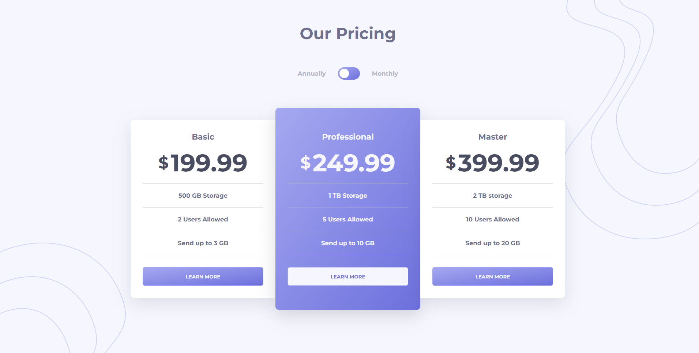

# Frontend Mentor - Pricing component with toggle solution

This is a solution to the [Pricing component with toggle challenge on Frontend Mentor](https://www.frontendmentor.io/challenges/pricing-component-with-toggle-8vPwRMIC). Frontend Mentor challenges help you improve your coding skills by building realistic projects.

## Table of contents

- [Overview](#overview)
  - [The challenge](#the-challenge)
  - [Screenshot](#screenshot)
  - [Links](#links)
- [My process](#my-process)
  - [Built with](#built-with)
  - [What I learned](#what-i-learned)
  - [Continued development](#continued-development)
  - [Useful resources](#useful-resources)
- [Author](#author)

## Overview

### The challenge

Users should be able to:

- View the optimal layout for the component depending on their device's screen size
- Control the toggle with both their mouse/trackpad and their keyboard
- **Bonus**: Complete the challenge with just HTML and CSS

### Screenshot

### Links

- Solution URL: [Solution URL](https://github.com/tan911/pricing-component-with-toggle)
- Live Site URL: [Live site](https://tan911.github.io/pricing-component-with-toggle/)

## My process

### Built with

- HTML5
- CSS
- Flexbox
- Desktop workflow
- JavaScript
- Sass

### What I learned

What I love about this challenges is that I could practice my skills using the technologies I used the most.

### Continued development

This site continuously working with accessibility, I also learning about accessibility so that everyone could use this site.

### Useful resources

- [Example resource 1](https://itnext.io/structuring-your-sass-projects-c8d41fa55ed4) - This helped me for a better idea of how to structure your sass file when you dealing with small projects like this but also when you working for a large project. I really liked this pattern and will use it going forward.

## Author

- Website - [Add your name here](https://www.your-site.com)
